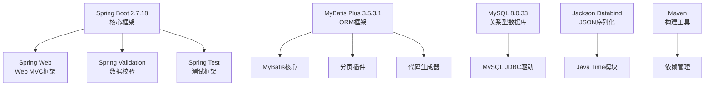
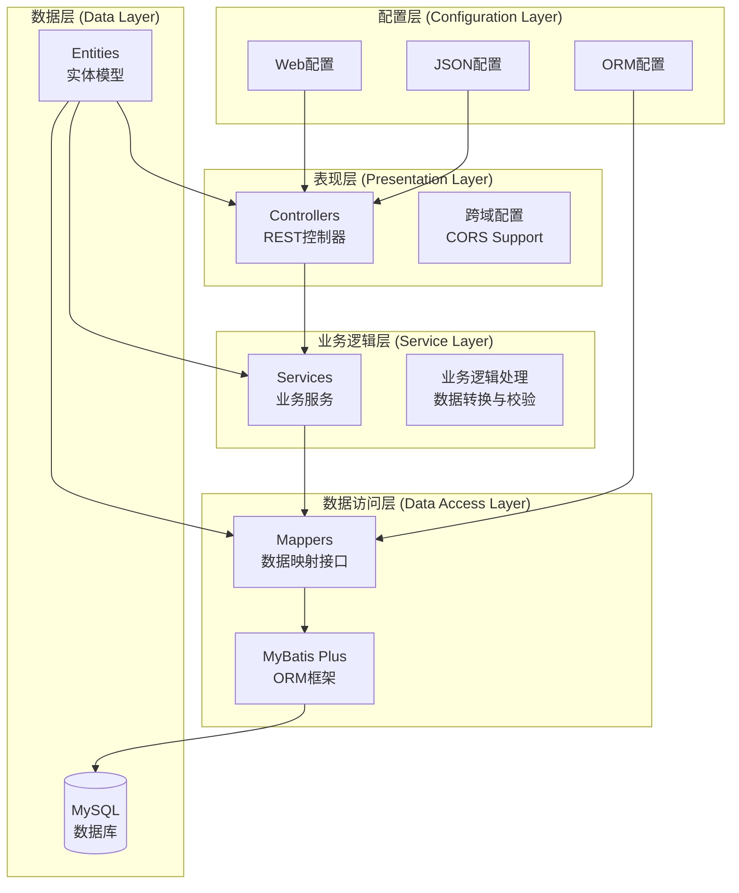
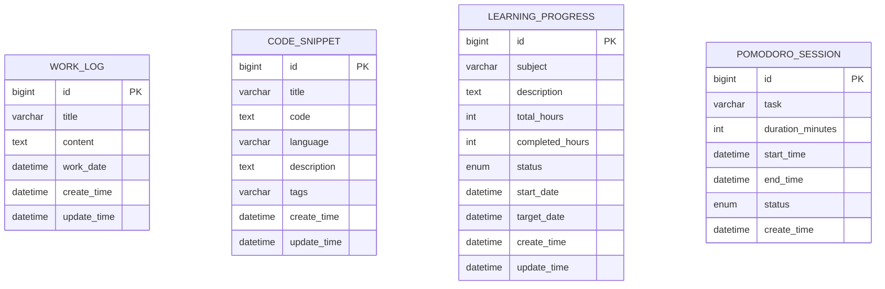
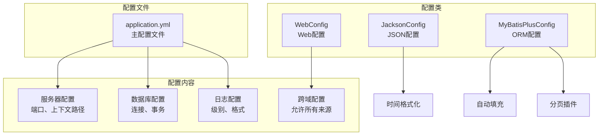
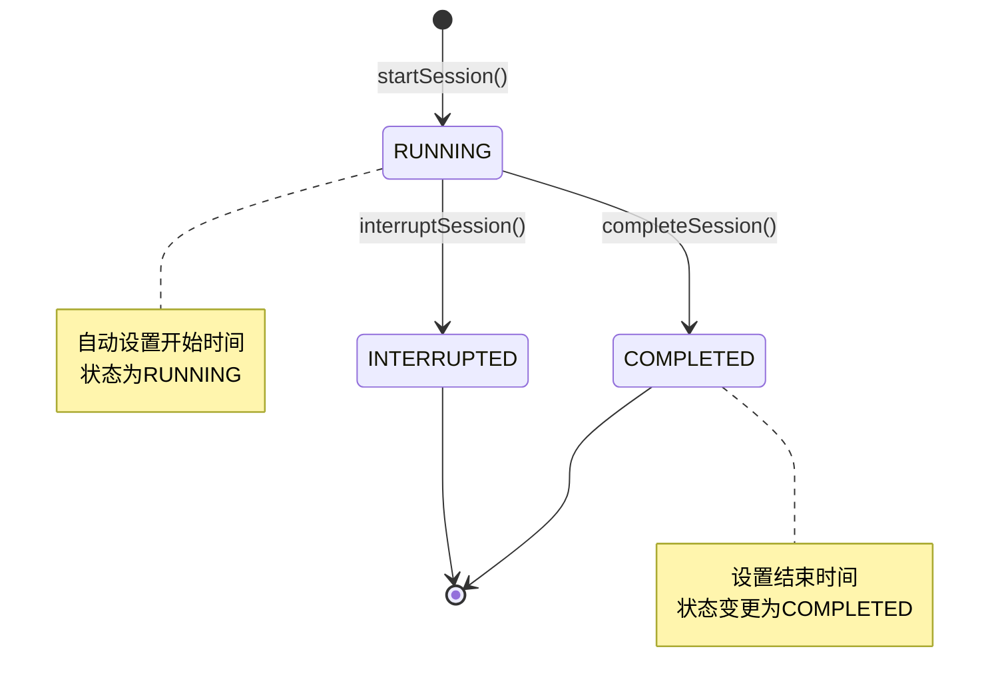
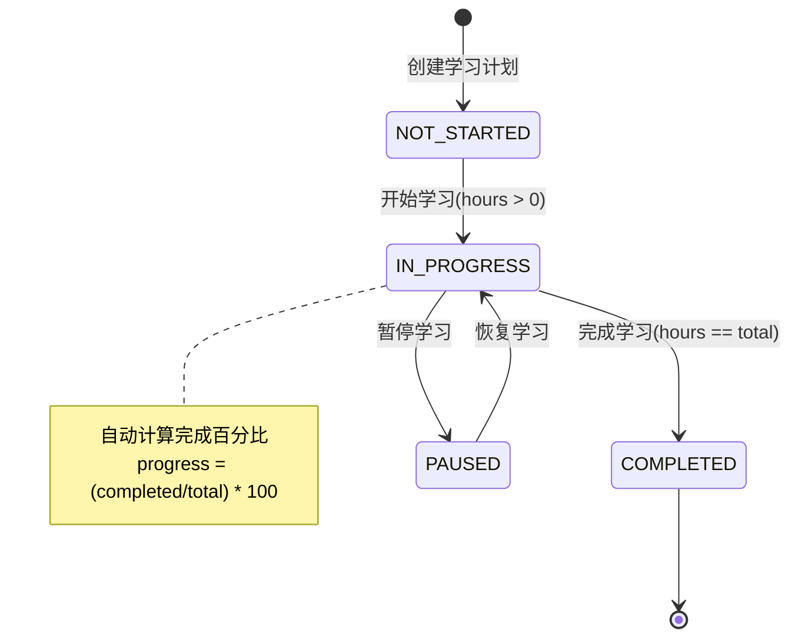
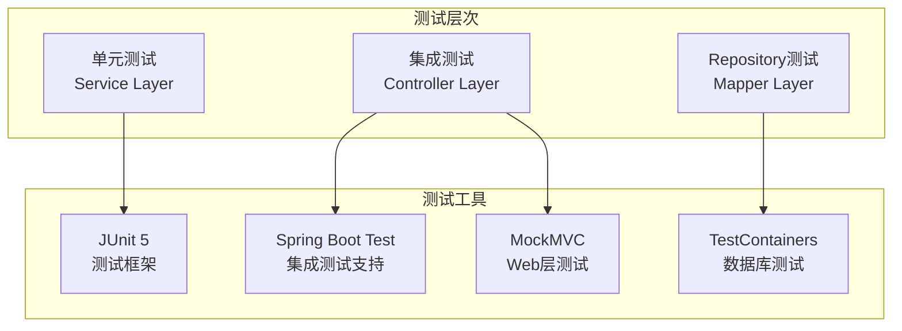

# 程序员日常工作助手后端架构分析

## 概述

程序员日常工作助手后端是一个基于Spring Boot构建的RESTful API服务，采用经典的MVC三层架构模式。该项目为程序员提供工作日志管理、代码片段收藏、学习进度跟踪、番茄钟计时和报表生成等核心功能。

**项目特点:**
- 前后端分离架构设计
- RESTful API标准实现
- MyBatis Plus作为ORM框架
- MySQL数据库持久化
- Spring Boot自动配置简化开发

## 技术栈分析

### 核心框架与依赖



### 技术选型说明

| 组件 | 版本 | 作用 | 选型理由 |
|------|------|------|----------|
| Spring Boot | 2.7.18 | 核心框架 | 成熟稳定、自动配置、快速开发 |
| MyBatis Plus | 3.5.3.1 | ORM框架 | 增强MyBatis、代码生成、分页支持 |
| MySQL | 8.0.33 | 关系型数据库 | 开源免费、性能优秀、社区活跃 |
| Jackson | - | JSON处理 | Spring Boot默认、功能完善 |
| Java | 8+ | 开发语言 | 企业级开发标准、生态成熟 |

## 架构设计

### 整体架构



### 分层架构详解

#### 1. 表现层 (Controller Layer)

**职责:** 处理HTTP请求、参数验证、响应格式化

**核心组件:**
- `CodeSnippetController` - 代码片段管理
- `WorkLogController` - 工作日志管理  
- `LearningProgressController` - 学习进度管理
- `PomodoroSessionController` - 番茄钟会话管理
- `ReportController` - 报表生成

**设计特点:**
```java
@RestController
@RequestMapping("/code-snippets")
@CrossOrigin(origins = "*")
public class CodeSnippetController {
    @Autowired
    private CodeSnippetService codeSnippetService;
    
    @PostMapping
    public ResponseEntity<CodeSnippet> createCodeSnippet(@RequestBody CodeSnippet codeSnippet) {
        // 统一返回ResponseEntity包装响应
    }
}
```

#### 2. 业务逻辑层 (Service Layer)

**职责:** 业务逻辑处理、数据转换、事务管理

**核心服务:**
- `CodeSnippetService` - 代码片段业务逻辑
- `WorkLogService` - 工作日志业务处理
- `LearningProgressService` - 学习进度计算与状态管理
- `PomodoroSessionService` - 番茄钟会话状态控制
- `ReportService` - 报表数据聚合与计算

**业务逻辑示例:**
```java
@Service
public class LearningProgressService {
    public LearningProgress updateProgress(Long id, Integer completedHours) {
        LearningProgress progress = findById(id);
        if (progress != null) {
            progress.setCompletedHours(completedHours);
            // 自动状态管理
            if (completedHours > 0 && progress.getStatus() == Status.NOT_STARTED) {
                progress.setStatus(Status.IN_PROGRESS);
            } else if (completedHours.equals(progress.getTotalHours())) {
                progress.setStatus(Status.COMPLETED);
            }
        }
        return progress;
    }
}
```

#### 3. 数据访问层 (Mapper Layer)

**职责:** 数据库操作、SQL映射、查询优化

**设计特点:**
- 继承MyBatis Plus的`BaseMapper`获得基础CRUD操作
- 使用注解方式编写自定义SQL查询
- 支持分页查询和条件构造器

```java
@Mapper
public interface CodeSnippetMapper extends BaseMapper<CodeSnippet> {
    @Select("SELECT * FROM code_snippet WHERE language = #{language} ORDER BY create_time DESC")
    List<CodeSnippet> findByLanguage(@Param("language") String language);
    
    @Select("SELECT DISTINCT language FROM code_snippet ORDER BY language")
    List<String> findAllLanguages();
}
```

## 数据模型设计

### 实体关系图



### 实体设计特点

**通用字段设计:**
- 使用`@TableId(type = IdType.AUTO)`自增主键
- 统一的时间戳字段：`create_time`、`update_time`
- MyBatis Plus自动填充时间字段

**状态枚举设计:**
```java
public enum Status {
    NOT_STARTED,    // 未开始
    IN_PROGRESS,    // 进行中
    COMPLETED,      // 已完成
    PAUSED          // 已暂停
}
```

## API接口设计

### RESTful API规范

**URL设计模式:**
```
GET    /api/code-snippets          # 获取所有代码片段
POST   /api/code-snippets          # 创建代码片段
GET    /api/code-snippets/{id}     # 获取指定代码片段
PUT    /api/code-snippets/{id}     # 更新代码片段
DELETE /api/code-snippets/{id}     # 删除代码片段
```

**统一响应格式:**
```java
public ResponseEntity<T> methodName() {
    // 成功响应
    return ResponseEntity.ok(data);
    
    // 资源不存在
    return ResponseEntity.notFound().build();
    
    // 创建成功
    return ResponseEntity.status(HttpStatus.CREATED).body(data);
}
```

### 核心API模块

| 模块 | 端点前缀 | 主要功能 |
|------|----------|----------|
| 工作日志 | `/work-logs` | 日志CRUD、搜索、时间范围查询 |
| 代码片段 | `/code-snippets` | 片段管理、语言分类、标签搜索 |
| 学习进度 | `/learning-progress` | 进度跟踪、状态管理、统计分析 |
| 番茄钟 | `/pomodoro-sessions` | 会话控制、计时管理、统计查询 |
| 报表 | `/reports` | 周报/月报生成、仪表板数据 |

## 配置管理

### 应用配置架构



### 关键配置说明

**数据库配置:**
```yaml
spring:
  datasource:
    url: jdbc:mysql://localhost:3306/programmer_assistant
    username: root
    password: root
    driver-class-name: com.mysql.cj.jdbc.Driver
```

**跨域配置:**
```java
@Override
public void addCorsMappings(CorsRegistry registry) {
    registry.addMapping("/api/**")
            .allowedOriginPatterns("*")
            .allowedMethods("GET", "POST", "PUT", "DELETE", "OPTIONS")
            .allowedHeaders("*")
            .allowCredentials(true);
}
```

## 业务逻辑设计

### 核心业务流程

#### 1. 番茄钟会话管理



#### 2. 学习进度状态管理



### 数据聚合与报表

**报表服务设计:**
```java
@Service
public class ReportService {
    public Map<String, Object> generateWeeklyReport() {
        // 1. 时间范围计算
        LocalDateTime endDate = LocalDateTime.now();
        LocalDateTime startDate = endDate.minusDays(7);
        
        // 2. 数据聚合
        List<WorkLog> weeklyLogs = workLogService.findByDateRange(startDate, endDate);
        List<PomodoroSession> weeklySessions = pomodoroSessionService.findByDateRange(startDate, endDate);
        
        // 3. 统计计算
        long completedSessions = weeklySessions.stream()
                .filter(session -> session.getStatus() == Status.COMPLETED)
                .count();
        
        // 4. 报表组装
        Map<String, Object> report = new HashMap<>();
        report.put("workLogCount", weeklyLogs.size());
        report.put("completedSessions", completedSessions);
        
        return report;
    }
}
```

## 测试策略

### 单元测试架构



**测试覆盖重点:**
- Service层业务逻辑单元测试
- Controller层API接口集成测试  
- Mapper层数据访问测试
- 配置类初始化测试